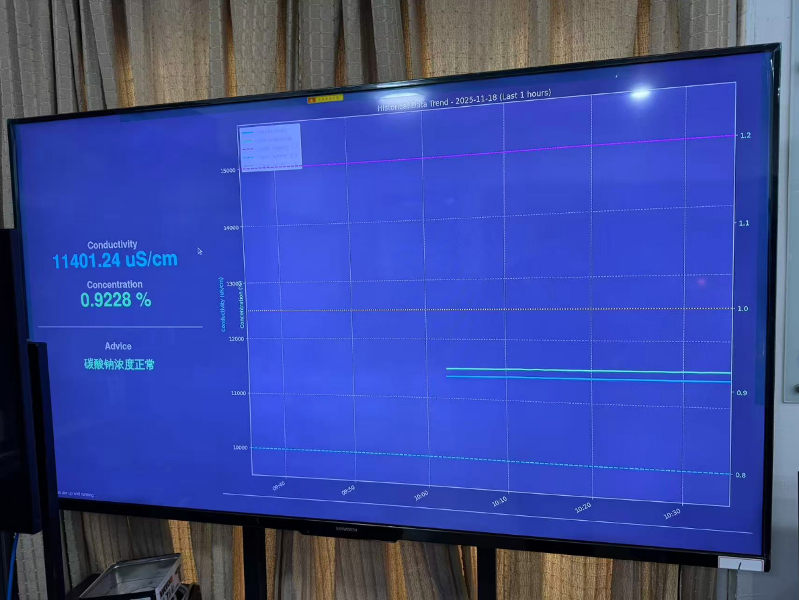
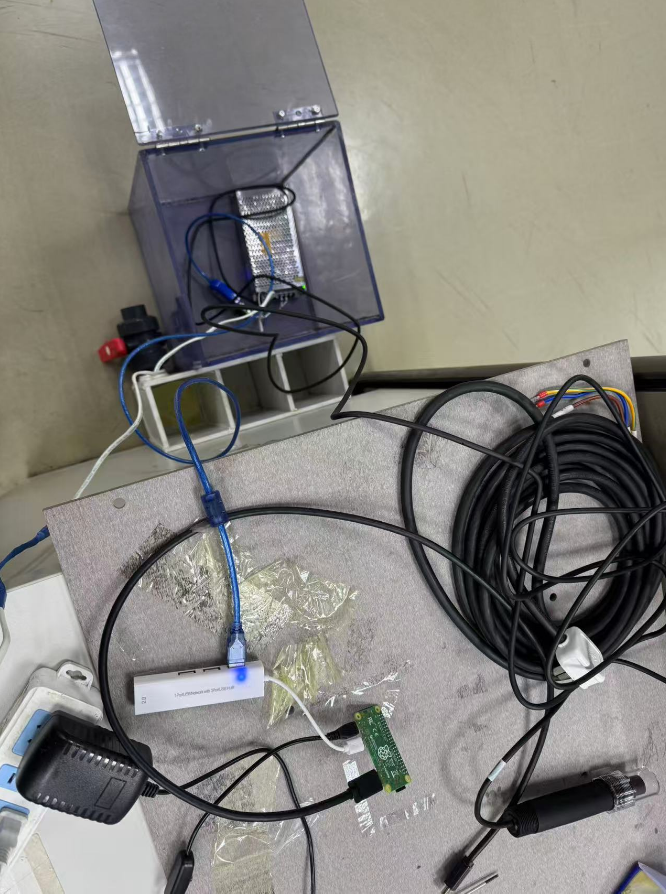

# 碳酸钠溶液浓度实时监测系统

这是一个用于实时、低成本地监测约1%浓度碳酸钠（显影溶液）的系统。项目通过可视化的GUI界面，直观地展示了溶液浓度的实时变化趋势，为相关化学处理过程提供数据支持。

## ✨ 功能特性

* **实时监测**: 持续测量并显示碳酸钠溶液的实时浓度和温度。

* **数据可视化**: 通过动态图表直观展示浓度随时间的变化趋势，便于分析和判断。

* **低成本方案**: 采用市面上易于获取且价格低廉的传感器和微控制器，适合个人爱好者或小型实验室使用。

* **简单易用的GUI**: 提供图形化用户界面，无需复杂的命令行操作。

## 🖥️ GUI 界面预览

## 🛠️ 所用硬件

## ⚠️ 注意事项

**如遇问题，请阅读根目录下的 说明文档.svg 文件！**
